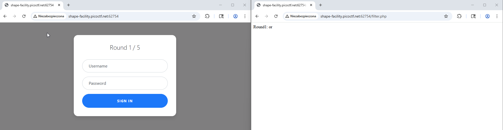
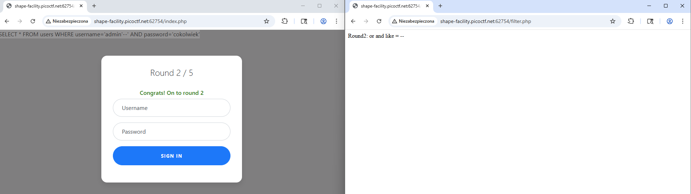
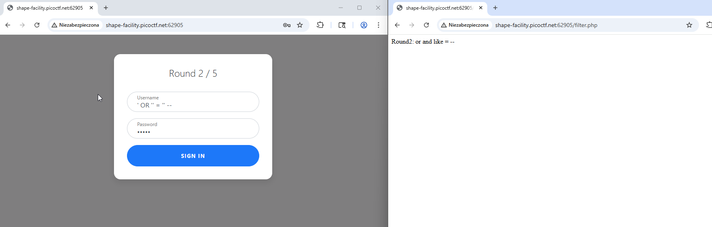
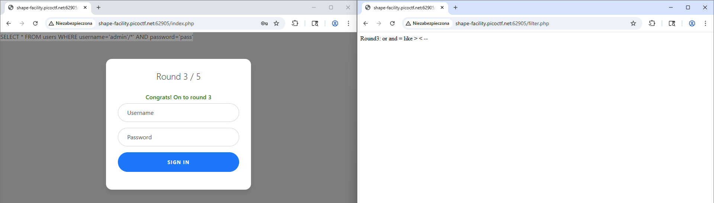
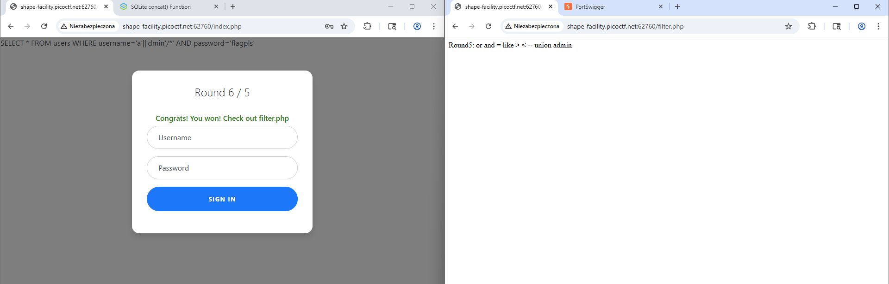
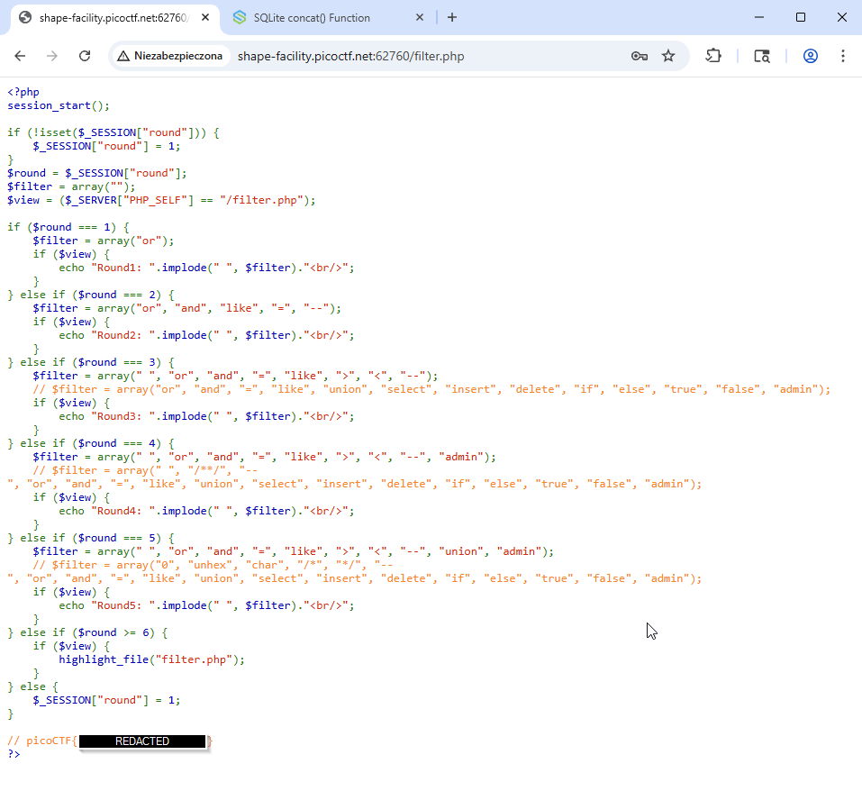

# SQL Injection — PicoCTF Web Gauntlet — short report

I faced the PicoCTF Web Gauntlet today. It was the hardest PicoCTF challenge I have completed so far, and I treated it as a final practical test for the SQL module.

---

## Setup

I launched the instance (30-minute lifetime) and opened two pages side by side: a simple login form and a page with a short clue for each round. I proxied the traffic through **Burp Suite** and used the embedded browser to observe requests and responses; that helped to inspect how the server transformed inputs.

---

## Overview of rounds and findings

The gauntlet enforces a whitelist-like filter per round (the clue shows which tokens are allowed). The trick is to build payloads using only permitted tokens or to find which constructs the filter does not normalize.

### Round 1 — clue: `or`

At first, I assumed I should use the OR operator. After testing, I realized the clue actually reflects the filter behavior (what is allowed), not what must be used.  

  

**Initial legitimate attempt:**

First I tried login without any injections `admin///admin`:

```
SELECT * FROM users WHERE username='admin' AND password='admin'
```

Then I tried comment `AND password` but I did it wrong :(
I entered into the username input: `admin--` but the whole expression was taken as literal:

```
SELECT * FROM users WHERE username='admin--' AND password='admin'
```

I fixed it quickly:

```
SELECT * FROM users WHERE username='admin'--' AND password='admin'
```

I closed the literal — and as it was closed then `--` comments anything further so default literal closure will be commented as well: `--' AND password='admin'` — the whole part after `--` is ignored.

### Round 2 — `OR` `AND` `LIKE` = `--` are filtered  

  

So no more `--`.
Let's try to comment it with `/*` (block comment): `admin'/*` with any password — and it works! I made it to round 3.

The payload sent to the server (illustrative):

```
SELECT * FROM users WHERE username='admin'/*' AND password='admin'
```

### Round 3: `OR` `AND` `LIKE` = `><` `--`  

  

The filter tightened, but block comments remained effective. Reusing the same technique still worked.

```
SELECT * FROM users WHERE username='admin'/*' AND password='admin'
```

### Round 4: `or` and `=` `like` `>` `<` `--` `admin`  

  

At this stage direct literal `admin` was not allowed, but string concatenation in SQLite was permitted. Since the backend used SQLite, I concatenated parts of the username with the `||` operator and used a block comment to ignore the password check:

```
a'||'dmin'/*
```

and it works!

The payload (illustrative):

```
SELECT * FROM users WHERE username='a'||'dmin'/*' AND password='gogogo'
```

### Round 5: `or` and `=` `like` `>` `<` `--` `union` `admin`  

  

It seems we can still re-use: `a'||'dmin'/*` and it works!

The payload (illustrative):

```
SELECT * FROM users WHERE username='a'||'dmin'/*' AND password='gogogo'
```

---

## Final step

The service exposed `filter.php` at the end of the gauntlet, which made the filter logic explicit. After inspecting it I found the bypasses I had already used were valid for the instance, and then I retrieved the flag.  

  

Thanks for reading.
