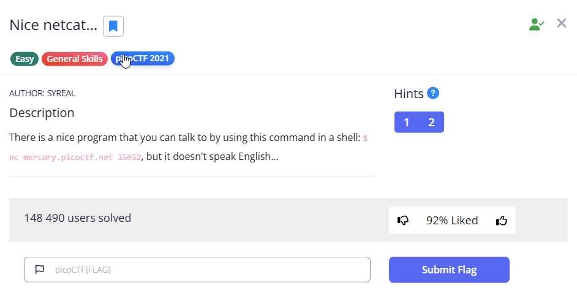

layout: post
title: "CTF Pack — 3x PicoCTF (two quick + one medium)"
date: 2025-10-09
categories: [CTF, picoCTF, writeups]
tags: [picoctf, writeup, netcat, forensics, beginner, medium]
🧩 PicoCTF Pack — 3 Challenges (1 medium + 2 easy)

A short write-up of three PicoCTF challenges solved today — two quick one-shots and one medium-level task.
Click each title below to expand the details.

Work environment
- System: latest Kali Linux in VMware  
- Tools: tmux 
- Work performed locally in a VM, using the terminal  

 
<b>1) what's a net cat</b>

what's a net cat
🔍 Description
 
It was warm up before medium level CTF I'm gonna take today.
To find the flag we will need to use then netact (nc) linux command.

🛠️ What I did

Connected to the host *****:
<code>nc host.example.com 12345</code>

Received response from a server containing the flag.

📸 Screenshot  
  
🏁 Flag
<code>picoCTF{PLACEHOLDER_WHATS_A_NET_CAT}</code>  
And the task was completed.  

 
<b>2) Lets Warm Up</b>

Lets Warm Up
🔍 Description
 
A very basic warm-up challenge before medium netcat task. Basically we need to convert hexadecimal to ascii.

🛠️ Steps (placeholder)

We got some information coded in hexadecimal. Its just a string displayed on the challenge page.
1. I did some quick resarch in the net, and found out that I can use xxd command. 
2. xxd -r -p takes a sequence of hexadecimal pairs (each pair = one byte) and rebuilds the raw binary data from them.
3. I just echoed the hexadecimal value from the challenge and used pipe to xxd -r -p and there we got an ascii value correspnding to the hexadecimal.

📸 Screenshot  

🏁 Flag  
<code>picoCTF{PLACEHOLDER_LETS_WARM_UP}</code>  

And we got the 2nd flag:  

 
<b>3) Nice netcat (medium)</b>

Nice netcat — (medium)
🔍 Description

A medium-level challenge involving netcat and ASCII conversion — we receive a stream of numbers (space-separated) that must be translated to readable text.

🛠️ Steps to solve

1. Using nc (netcat) command - I connected to the server:
<code>nc mercury.picoctf.net 35652</code>
2. I saw that the output are numbers in decimal separated by break lines '\n' and wihte spaces.
3. I saved the output into the file.  
  
4. I removed '\n' separators and I could see numbers separated with white spaces  
5. Aaand here I made a mistake: I removed the white spaces
6. I've opened file with numbers without any spaces.  
  
7. At this point I understood my mistake - the numbers were separated for the reason, each individual number correspond to symbol in ASCII
8. I can't use xxd command which translates hexadecimal to ASCII, I need to ask google :D and it seems awk is the answer
9. I converted a stream of space-separated decimal byte values into readable ASCII using awk and simple loop which to decode decimals to ASCII and save output to new file
10. I open new decoded file with cat command and here it is, the flag:  
  

Next challange completed:  
  

I think its worth to give some explenation regarding awk and the loop I used:
I converted a stream of space-separated decimal byte values into readable ASCII using awk (AWK is a lightweight text-processing language commonly used in Unix systems.
It reads input line by line, splits each line into fields, and lets you perform quick actions or transformations — for example, converting numbers to ASCII characters).

awk '{ ... }' file – runs the AWK program on each input line from the given file.

for(i=1;i<=NF;i++) – loops over every field (NF = number of fields, it is variable built in awk, fields are split by whitespace - perfect, numbers are sepaated by whitspaces).

printf "%c", $i – similiar like in C "%c" in printf prints each field’s numeric value as its corresponding ASCII character.
%c -> value as char
%d → valu as decimal
%x → value as hexadecimal
%s → value as string
So we can quickly change flag back into decimal or hexadecimal, then translate with xdd command :D

print "" – prints a newline after finishing the loop.

The one-liner walks every field in each line, treats the field as a numeric byte, prints that byte as the corresponding ASCII character, and ends the line.

Read the decoded file and retrieved the flag.

AWK is incredibly efficient for iterating over fields and converting numeric values to characters.

Always check the number format (decimal / hex / octal) before converting.

