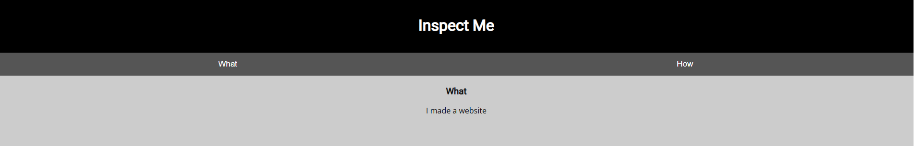

layout: post
title: "CTF Pack WebExploration — 5x PicoCTF (two quick + one medium)"
date: 2025-10-09
categories: [CTF, picoCTF, writeups]
🧩 PicoCTF Pack — 5 Challenges form Web Exploration (3 medium + 2 easy)

A short write-up of three PicoCTF challenges solved today — two quick one-shots and one medium-level task.
Click each title below to expand the details.

Work environment
- System: Windows + Chrome newest version
- Tools: Burpsuite, DevTools, Cookie-Editor
- Work performed locally on my PC  

 
<b>1) insp3ct0r </b>

Inspector
🔍 Description
 
First task from Web Exploration field. Here we will have to use DevTools to inspect the site and find the flag.

🛠️ What I did

Opened the page: http://jupiter.challenges.picoctf.org:9670
The page looks like this:  
  
And I click on the HOW tab. Here we can see that to make this site creator used a HTML, CSS and JS.  
  

1. I open DevTool (F12) and start inspecting DOM. Almost immediately I found 1st part of the flag in the HTML file:
   

3. Then I move to sources and check mycss.css where I found 2nd part of the flag
   
  

5. And then move to myjs.js where the last part of the flag is waiting.  

  

 
<b>2) Where are the robots? </b>

 Where are the robots?
🔍 Description
 
Pretty simple challenge. As the name indicates we will be checking robots.txt file  

🛠️ Steps

1. I open an URL given in the task, and I add at the end of it /robots.txt 
(<i>a text file that website owners create to tell web crawlers (like search engine bots) which pages or directories on their site should not be crawled</i>)  
  
2. In the robot.txt we can see disallow file.html. I puit it at the end of the URL and there is the flag!  
  

 
<b>3) GET A HEAD (medium)</b>

GET A HEAD — (medium)
🔍 Description

A medium-level challenge involving the Burp Suite to manipulate the HTTPS requests.

🛠️ Steps to solve

1. Open the link from the task: http://mercury.picoctf.net:21939/  
  
2. The site changes color accordingly to the button we click. If we click blue option there is POST request, when red there is a GET  
BLUE:  
  
RED:  
  
3. As the title of the challenge is GET a HEAD - I assume the GET is the request we want to experiment with. I intercept GET request and switch GET for HEAD - as in the challenge title and send
And there it is! The flag:  

 
<b>4) Cookies (medium)</b>

Cookies — (medium)
🔍 Description
Who doesn't love cookies? Try to figure out the best one.
Here we will have to use cookies to find the flag. I'll use Chrome add-on Cookie-Manager - which allows users to view, edit, delete, and manage the cookies stored by their browse

🛠️ Steps to solve

1. I opened the page: http://mercury.picoctf.net:17781/ It looked like this:  
  
After opening page we could see only one cookie Named: name with Value: -1  
3. First I opened Cookie-Editor add-on and tried to add earch for the cookie from the placeholder in the search bar: snickerdoodle - it was proper value, but wrong cookie. We got new cookie with value 0  
4. Idea that popped in my head was: There is too many kind of cookies to tre guessing it :D. Let's try from a different angle.  
  
5. I use Cookie-Editor to change the cookie value from 0, to 1 save it and reload the page and we got next cookie name but still wrong  
6. Then I trieds 50, 40, 30 - nothing. Tried 20 and it works but wrong cookie (at this point I hoped the last one will be the flag) so I tried 29 - nothing, then 28 - cookie, but again, not very special... :)  
7. Finally I found the right one!  
  

I'll add automated solution with Burp Suite intruder or another script soon, because it seems very so i'll leave place here for it! :D

 
<b>5) Scavenger Hunt (medium)</b>

Cookies — (medium)
🔍 Description
There is some interesting information hidden around this site.
We will search throrugh the page, to find parts of the flag.

🛠️ What I did

1. First ofcourse I open the page: http://mercury.picoctf.net:5080/  
2. And start classic from DevTools and DOM analyzing and immediately we can see first part of the flag  
  
3. Then I go to sources and and CSS and here is the 2nd part... however we don't know how many parts there is, I don't think it will be only 3 :D  
  
4. Let's go see the js file. Here we have hint <i>How can I keep Google from indexing my website?</i> instead of the flag part:
5. The idea that comes to my mind is to check as in previous challenge - robots.txt - so I add it to the URL and there it is 3rd part with another hint
  
6. Here I stucked for a moment, had no really idea where to search only hint was that its apache. After about ~1hr of tries and doing some resarch I found that: .htaccess is a configuration file used by Apache-based web servers and it worked - I replaced /robots.txt at the end of the URL with /.htaccess and I found it 4th part of the flag with another hint  

7. And another resarch, after some time I found that DS_Store is a file that stores custom attributes of its containing folder, such as folder view options, icon positions - It took me a while to find out, but there is final part!

